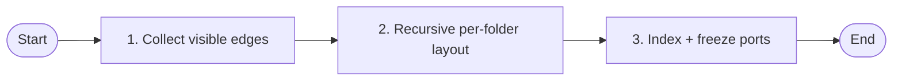
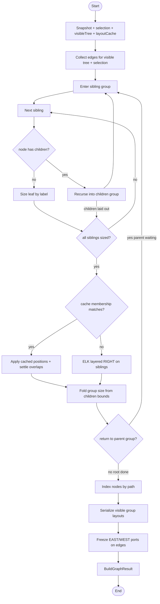

# buildGraph

Layout is bottom-up per folder: recurse to size children first, then place siblings (layout cache when membership matches, otherwise ELK layered RIGHT), fold parent size, unwind. A cache hit skips ELK for that group only.

Runs in a worker via [`useBuildGraph`](../../src/App/partials/DependencyGraph/partials/GraphCanvas/hooks/useBuildGraph/useBuildGraph.ts).

Implementation: [`buildGraph.ts`](../../src/App/partials/DependencyGraph/partials/GraphCanvas/helpers/buildGraph/buildGraph.ts), [`layoutGroup.ts`](../../src/App/partials/DependencyGraph/partials/GraphCanvas/helpers/buildGraph/layoutGroup/layoutGroup.ts).

## Overview

## Detail

