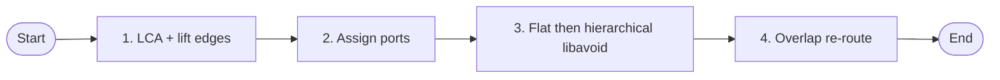
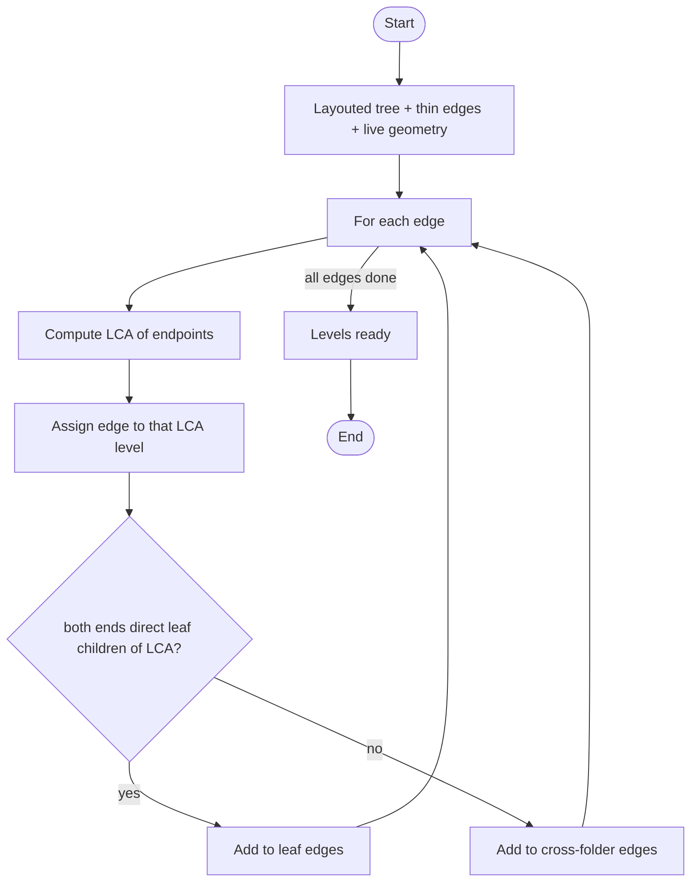
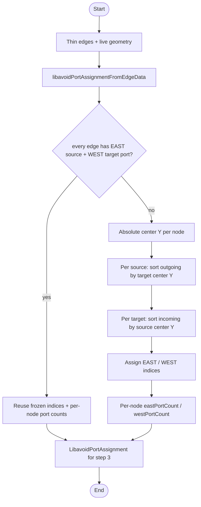
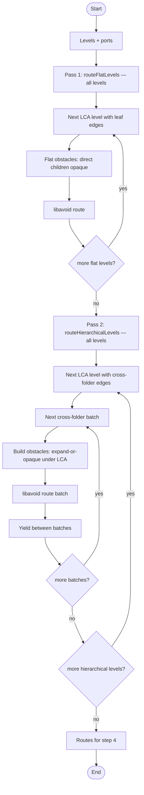
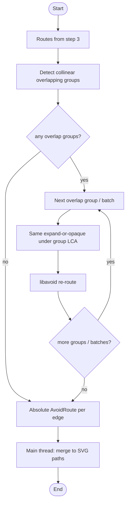

# libavoid edge routing

Four steps. ELK JSON shape is only the obstacle wire format for libavoid — no ELK layout runs here. Recursion expands folders that contain endpoints; other folders stay opaque. Edges are batched for libavoid; between batches the worker yields. In-flight / drag UI uses smooth-step.

Runs in a worker when `edgesType` is `libavoidOrthogonal` via [`useLibavoidEdgeRouting`](../../src/App/partials/DependencyGraph/partials/GraphCanvas/hooks/useLibavoidEdgeRouting/useLibavoidEdgeRouting.ts).

Implementation: [`routeEdgesWithLibavoid.ts`](../../src/App/partials/DependencyGraph/partials/GraphCanvas/helpers/routeEdgesWithLibavoid/routeEdgesWithLibavoid.ts), [`collectRoutingLevels.ts`](../../src/App/partials/DependencyGraph/partials/GraphCanvas/helpers/routeEdgesWithLibavoid/collectRoutingLevels/collectRoutingLevels.ts), [`nodesToLibavoidGraph.ts`](../../src/App/partials/DependencyGraph/partials/GraphCanvas/helpers/routeEdgesWithLibavoid/nodesToLibavoidGraph/nodesToLibavoidGraph.ts).

## Overview

## Step 1 — LCA and lift edges

Input: layouted visible tree, thin edges, live geometry. Each edge is lifted to the LCA of its endpoints and assigned to that folder level (or the virtual root). Within a level: leaf↔leaf among direct children vs cross-folder.

## Step 2 — Assign ports

Global EAST/WEST port indices for every routable edge, shared across flat, hierarchical, and overlap passes. Prefer frozen ports from `buildGraph` when every thin edge carries them; otherwise assign at route time by opposite-endpoint Y (slots top-to-bottom). Runs after levels are collected, before any libavoid call.

## Step 3 — Flat then hierarchical libavoid

Two global passes over all LCA levels (not interleaved per level): first `routeFlatLevels` for every level’s leaf edges, then `routeHierarchicalLevels` for every level’s cross-folder edges (batched). Flat pass: opaque direct children of the LCA. Hierarchical pass: expand folders whose subtree contains an endpoint, keep others opaque; yield between batches.

## Step 4 — Overlap re-route

Detect collinear overlapping route groups, then for each group/batch reuse expand-or-opaque under the group LCA and re-route with libavoid. The main thread merges absolute routes into SVG paths (`mergeAvoidRoutes` in `useLibavoidEdgeRouting`).

